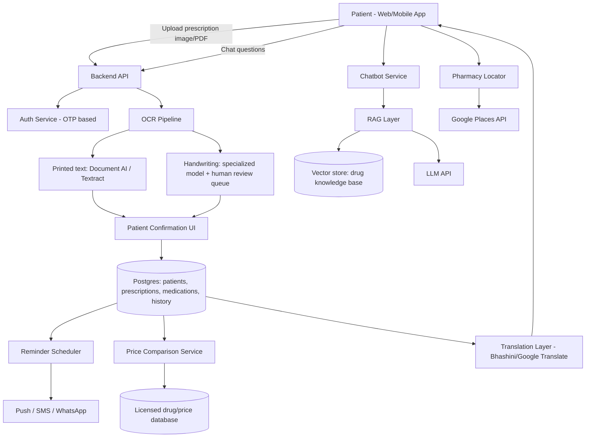

# Arogya — Build Plan & Checklist

**A multilingual patient companion: prescription OCR, medication reminders, patient history, an AI health chatbot, and medicine price comparison, built for India first.**

Scope of this document: MVP-first, phased roadmap. Region: India (v1), with an architecture that can extend to other regions later.

---

## 0. Read this first — the three things that will make or break this product

Before any feature checklist, these three findings from research change how the product must be designed. Skipping them is how health apps end up unsafe or unlaunchable.

1. **Handwritten prescriptions are the hard case, and OCR alone is not safe enough.** Benchmarks show commercial OCR/handwriting-recognition engines score around 99% on clean printed text but swing anywhere from roughly 20% to 96% on handwriting, depending on legibility — doctors' handwriting being a famously bad case. A misread drug name or dosage is a patient-safety incident, not a UX bug. **Every OCR-extracted prescription must go through a human-confirmation step** (the patient reviews and confirms each extracted field before it's saved or acted on) before it drives reminders, price comparisons, or chatbot answers. Do not auto-trust OCR output for anything dosage-related.
2. **India has no dedicated e-pharmacy law yet, and this affects your "suggest a cheaper medicine" feature directly.** Online drug sales fall under the 1940 Drugs and Cosmetics Act (a 2015 government notice extended it to online sale); prescription-only drugs still require a valid prescription and licensed-pharmacist dispensing, e-pharmacies currently operate in a legal gray zone, proposed rules would ban medicine advertising outright, and amendment rules mandating e-pharmacy registration have been pending since 2018. Practically: **Arogya should be an informational/comparison layer, not a seller.** Show generic-equivalent names, compositions, and indicative prices; do not facilitate the actual sale or delivery of prescription drugs in v1, and get real legal review before you do. ([SCC Times](https://www.scconline.com/blog/post/2023/11/02/regulation-of-online-pharmacies-in-india/), [Spice Route Legal](https://spiceroutelegal.com/publications/regulation-of-e-pharmacies-in-india/))
3. **The DPDP Rules 2025 are real and dated, not hypothetical.** India's Digital Personal Data Protection Rules 2025 were notified on 14 November 2025, with compliance staggered: immediate Data Protection Board setup, a 12-month mark for Consent Manager provisions, and an 18-month mark for core obligations (consent notices, purpose limitation, security safeguards, retention/erasure workflows, 72-hour breach notification to the Board). Health data is about as sensitive as personal data gets — build consent, retention limits, and breach-response into the architecture from day one rather than retrofitting them. ([India Briefing](https://www.india-briefing.com/news/dpdp-rules-2025-india-data-protection-law-compliance-40769.html/), [KPMG](https://kpmg.com/in/en/insights/2025/12/the-privacy-prescription-impact-of-dpdp-act-and-rules-in-healthcare-and-life-sciences-sector.html))

Keep these three in view while reading everything below — they're referenced throughout as ⚠️.

---

## 1. Product vision, restated

A patient uploads a prescription (photo or PDF) in whatever language it's written in. Arogya extracts the medicines, dosages, and schedule; lets the patient confirm it in their own language; stores it as part of a lifelong medical history; reminds them when to take each medication (with drug-specific handling notes, e.g. insulin storage temperature); answers questions about their conditions and medicines through a chatbot; suggests diet guidance per condition; and shows cheaper generic-equivalent options and nearby pharmacies for what's been prescribed — all without ever presenting itself as a substitute for the prescribing doctor or a seller of medicine.

---

## 2. Non-negotiable guardrails (design principles, not features)

- [ ] **Arogya suggests, it never diagnoses or prescribes.** Every chatbot answer and every "cheaper alternative" surfaces information; it does not tell the user to switch medication without their doctor/pharmacist. Standing disclaimer on every medical answer.
- [ ] **Human confirms every OCR read before it becomes "fact."** No auto-scheduling of reminders from unconfirmed OCR text.
- [ ] **No unverified drug-safety claims from the chatbot.** All chatbot medical content is grounded (RAG) against a curated, licensed drug database — not free-form LLM generation — see §6.6.
- [ ] **Data minimization + explicit consent**, mapped to DPDP obligations, from the first commit — not bolted on before a compliance audit.
- [ ] **Escalate to "see a doctor / call emergency services"** for anything that looks like an emergency (chest pain, overdose, allergic reaction, suicidal ideation) instead of answering in-chatbot.
- [ ] Every clinical fact (drug name, storage condition, interaction, contraindication) traces to a cited source in the answer, so patients — and your legal team — can verify it.

---

## 3. Recommended tech stack

Picked for a small team building this from scratch, optimizing for speed to MVP, strong OCR/multilingual ecosystem fit for India, and a straightforward path to HIPAA-style/DPDP-style compliance later.

| Layer | Recommendation | Why |
|---|---|---|
| Frontend (web) | React + TypeScript, Next.js | SSR for fast first paint, huge ecosystem, easy i18n libraries (`react-i18next`) |
| Mobile (Phase 2) | React Native or Flutter | Push notifications for reminders need a real mobile app eventually; reuse logic from web where possible |
| Backend API | Node.js (NestJS) or Python (FastAPI) | FastAPI if the team leans Python/ML-heavy (easier to share code with the OCR/NLP pipeline); NestJS if the team is more JS/TS-native |
| Database | PostgreSQL (primary) + Redis (cache/queue) | Relational integrity for patient/medication/schedule data; Redis for reminder scheduling and session cache |
| File/image storage | S3-compatible object storage (AWS S3 / Cloudflare R2) | Store original prescription images/PDFs encrypted at rest |
| OCR | Google Cloud Document AI or AWS Textract for printed text; a specialized/fine-tuned handwriting model (or human-in-the-loop transcription service) for handwritten scripts | Printed text OCR is essentially solved (~99%); handwriting is not — plan a fallback path, not just an API call |
| Regional language OCR + translation | Bhashini (India's national language AI platform — free government APIs for ASR, translation, TTS, OCR across major Indian languages) as a first option; Google Cloud Translation API as a commercial fallback | Purpose-built for Indian languages incl. Hindi, Tamil, Telugu, Kannada, Malayalam, Bengali, Marathi, Gujarati, Punjabi, Odia, Assamese, Urdu |
| Chatbot / LLM orchestration | Claude or GPT-class model via API, wrapped in a RAG pipeline over a curated drug-knowledge base (not open free-text) | Grounding is mandatory for medical safety — see §6.6 |
| Vector store (for RAG) | pgvector (inside Postgres) to start; move to a dedicated vector DB (Pinecone/Weaviate) only if scale demands it | Avoid extra infra until you need it |
| Drug data source | RxNorm / openFDA for structured drug data (US-normalized, useful for interactions/classes); a licensed Indian drug database (e.g. a commercial CIMS/MIMS-style API) for India-specific brand names, pricing, and Jan Aushadhi generic equivalents | No fully public, structured Jan Aushadhi price API was found in this research — budget for either a paid data provider or a manual/periodic-scrape-and-verify pipeline, kept current |
| Pharmacy locations | Google Places API (nearby pharmacies) for v1; real-time stock is not reliably available from any public source in India — see §6.8 | Set expectations: "pharmacies near you," not "confirmed in stock" |
| Notifications | Firebase Cloud Messaging (push) + Twilio or MSG91 (SMS/WhatsApp) as a fallback for patients without a smartphone app open | WhatsApp reminders matter a lot for reach in India |
| Auth | OTP-based phone login (most accessible for the target users) via Firebase Auth / AWS Cognito / a local provider like MSG91 | Email/password is a worse fit for many patients; phone OTP is the norm in Indian consumer health apps |
| Infra | AWS or GCP, containerized (Docker), orchestrated via ECS/Cloud Run to start (skip Kubernetes until scale justifies it) | Keep ops overhead low for a small team |
| Optional, Phase 3+ | ABDM/ABHA integration (India's Ayushman Bharat Digital Mission health-ID system) for interoperable health records | Adds real credibility and lets patients port records to hospitals, but is a substantial integration — not MVP |

---

## 4. High-level architecture

---

## 5. Data model sketch (core entities)

- [ ] `Patient` — id, name, phone (OTP-verified), preferred language, date of birth, consent records, DPDP consent timestamp/version
- [ ] `Prescription` — id, patient_id, original file (encrypted, object storage), upload date, prescribing doctor (optional, free text), OCR raw output, patient-confirmed structured output, confirmation status
- [ ] `Medication` — id, prescription_id, drug name (as written), matched canonical drug (RxNorm/local DB id), dosage, frequency, duration, route (oral/injectable/topical), special-handling notes (e.g., "store at 2–8°C")
- [ ] `Schedule` — id, medication_id, reminder times, timezone, active/paused, adherence log (taken/skipped/snoozed, timestamp)
- [ ] `MedicalHistoryEntry` — id, patient_id, type (prescription/condition/allergy/lab result), linked_prescription_id (nullable), notes, date
- [ ] `Condition` — id, patient_id, name (diabetes, hypertension, etc.), diagnosed_date, notes — drives diet-suggestion and chatbot context
- [ ] `ChatSession` / `ChatMessage` — id, patient_id, message, role, citations (drug DB source ids), timestamp
- [ ] `DrugKnowledge` (RAG source) — canonical name, composition, class, storage requirements, common interactions, contraindications, source/citation
- [ ] `PriceEntry` — drug_id, brand/generic flag, manufacturer, price, source, last_updated
- [ ] `Pharmacy` — id, name, address, geo-coordinates, phone, source (Google Places id)
- [ ] `ConsentRecord` — patient_id, consent type, granted/withdrawn, timestamp, DPDP purpose text shown at time of consent

---

## 6. Feature-by-feature deep analysis

### 6.1 Onboarding & authentication

- [ ] Phone-number OTP signup/login (most accessible for target users; avoids password-reset friction for less tech-savvy or elderly patients)
- [ ] Language selection on first launch, changeable anytime, applied across UI, notifications, and chatbot responses
- [ ] Explicit, plain-language consent screen (DPDP-aligned): what data is collected, why, retention period, how to withdraw consent — not a wall of legalese
- [ ] Optional: caregiver/family-member accounts linked to a patient profile (common need for elderly patients who won't self-manage an app)
- [ ] Accessibility pass: large text option, voice input for low-literacy or low-vision users (Bhashini supports ASR — speech-to-text — for several Indian languages, useful here)

### 6.2 Prescription upload & OCR pipeline ⚠️ (see §0.1)

- [ ] Capture via camera or file upload (image/PDF), with in-app guidance for a good photo (flat, well-lit, no shadows/glare) — image quality drives OCR accuracy more than the OCR engine choice
- [ ] Pre-process image (deskew, contrast enhancement, crop) before OCR
- [ ] Route printed text through Document AI/Textract; route handwriting through a specialized handwriting model or a human-transcription queue (a pragmatic MVP option: cheap outsourced human transcription for the handwriting cases the model flags low-confidence, rather than trying to solve handwriting OCR from day one)
- [ ] Structure the extraction into fields: drug name, strength, dosage, frequency, duration, doctor's instructions
- [ ] Fuzzy-match extracted drug names against a canonical drug database (brand ↔ generic mapping) so typos/OCR errors ("Paracetmol") still resolve correctly, but always show the matched result to the patient for confirmation
- [ ] **Mandatory patient confirmation screen**: side-by-side original image and extracted fields, editable, before anything is saved as "confirmed"
- [ ] Low-confidence extractions are visually flagged and require extra confirmation, not silently accepted
- [ ] Store the original image indefinitely (or per retention policy) as the source of truth patients/doctors can always refer back to

### 6.3 Multilingual support

- [ ] Full UI localization (not just chatbot) — menus, buttons, notification text, medication names shown in the patient's language where a safe translation exists
- [ ] For drug names specifically: show the international/generic name plus a transliteration, not a translated name — drug name mistranslation is a safety risk, so translate instructions and explanations freely, but treat drug names as near-invariant identifiers
- [ ] OCR + translation pipeline must handle the prescription's source language separately from the patient's display language (a prescription in English can still need to be explained in Tamil)
- [ ] Use Bhashini APIs as the primary translation/ASR/TTS layer for Indian languages (free, government-backed); fall back to a commercial API for languages/edge cases Bhashini doesn't cover well
- [ ] Voice output (TTS) for reminders and chatbot answers — valuable for low-literacy users
- [ ] Right-to-left / script-rendering QA for languages that need it (Urdu, etc.)

### 6.4 Patient history storage

- [ ] Chronological, filterable timeline: prescriptions, conditions, allergies, adherence history
- [ ] Every entry links back to its source (which prescription, which upload) for traceability
- [ ] Exportable as PDF (for showing a doctor) — a genuinely high-value, low-risk feature to prioritize early
- [ ] Retention & deletion policy implemented technically, not just in a privacy policy (DPDP requires this — see §0.3)
- [ ] Consider (Phase 3) ABDM/ABHA integration so a patient's Arogya history can plug into India's national health record system — high credibility, high integration cost, not MVP

### 6.5 Medication reminders & notifications

- [ ] Schedule derived only from **confirmed** medication data (never raw OCR)
- [ ] Support for complex schedules: multiple times/day, "with food," "every other day," taper schedules
- [ ] Multi-channel delivery: push notification (primary), SMS/WhatsApp fallback for patients who don't keep the app open — this matters a lot for reach and for elderly/less tech-savvy users
- [ ] Adherence logging: "Taken / Snooze / Skipped," feeding both the patient's own history and (optionally, with consent) a caregiver view
- [ ] **Drug-specific handling reminders**, not just "take now": e.g., insulin needs refrigeration between 2–8°C before opening and has a defined room-temperature-after-opening window; this data lives in the `DrugKnowledge` table (§5) and surfaces both as a one-time "storage instructions" card when the medication is added and as an occasional reminder nudge (e.g., "traveling? insulin needs a cool bag")
- [ ] Missed-dose logic that's clinically sensible per drug class where possible (some drugs say "skip if close to next dose," others don't) — this content must come from the curated drug database, not be improvised by the reminder engine
- [ ] Snooze/reschedule that respects the drug's dosing window rather than allowing arbitrary delay

### 6.6 Chatbot — architecture and safety

This is the feature most likely to cause harm if built casually, so treat it as an engineering problem with a specific shape, not "call an LLM."

- [ ] **Retrieval-Augmented Generation (RAG), not free-form generation.** The chatbot answers by retrieving from a curated `DrugKnowledge` base (composition, storage, interactions, contraindications, sourced from licensed drug databases / regulatory sources) and diet-guidance content (sourced from clinical dietary guidelines per condition), then has the LLM compose a readable, cited answer — it does not invent medical facts from general training knowledge.
- [ ] Every factual claim in a chatbot answer carries a source citation the patient can tap to see (builds trust, and is your best defense if a claim is later disputed)
- [ ] Context-aware: the chatbot has access to the patient's own confirmed medications/conditions (with consent) so answers are personalized — "your metformin" not generic drug info
- [ ] Scope boundaries enforced at the prompt/system level: answer questions about medicines, storage, interactions, general disease/diet information; refuse (and redirect to a doctor) requests for diagnosis, dosage changes, or anything emergency-flagged
- [ ] Emergency-language detection (chest pain, suicidal ideation, overdose, severe allergic reaction, "can't breathe") routes to an immediate "please contact emergency services / a doctor now" response, not a chatbot answer
- [ ] Example capability to explicitly build and test: "I have diabetes and take insulin — how should I store it, and what should I eat?" → answer combining `DrugKnowledge` (storage) + `Condition`-linked diet guidance, with citations
- [ ] Multilingual chatbot: the RAG pipeline retrieves language-agnostic structured facts, and generation happens in the patient's chosen language, rather than translating a pre-written English answer (better fidelity)
- [ ] Logging + human review sampling of chatbot conversations (with privacy safeguards) to catch bad answers before they compound into a pattern

### 6.7 Condition-based diet guidance

- [ ] Curated, clinician-reviewed diet guidance content per common condition (diabetes, hypertension, kidney disease, thyroid, etc.) — "foods to avoid / foods to prefer / general notes" — stored as structured content, not generated ad hoc
- [ ] Surfaced both proactively (when a condition is added to the patient's profile) and reactively (via chatbot questions)
- [ ] Clearly sourced and dated, with a "this is general guidance, not a diet plan — consult a dietitian for a personalized plan" disclaimer
- [ ] Cross-check against the patient's actual medications for interaction-relevant notes (e.g., don't recommend high-vitamin-K foods without a note for a patient on warfarin) — this is a stretch goal requiring real clinical review, not a v1 must-have

### 6.8 Price comparison & generic alternatives ⚠️ (see §0.2)

- [ ] Show the prescribed drug's **composition** (active ingredient(s) + strength) prominently — this is the actual basis for a valid comparison, not just brand name
- [ ] Look up other branded and generic products with the same composition and strength, including Jan Aushadhi generic options where available, with indicative price per unit
- [ ] Clearly label this as **informational price comparison**, not a purchase flow or a medical recommendation to switch — include a "check with your pharmacist/doctor before switching brands" note, since bioavailability and excipients can matter even at identical active-ingredient dose
- [ ] Data sourcing reality check: there is no reliable free/public structured API for Jan Aushadhi or general Indian medicine pricing found in this research — plan for either a licensed commercial drug-data provider (budget line item) or a manually curated, periodically updated price table starting with the most commonly prescribed drugs (a realistic MVP approach: start with the ~100–200 most common generics rather than trying to cover everything)
- [ ] Get legal review before this feature ships, specifically on the e-pharmacy gray-zone question (§0.2) — "compare and inform" is very different, legally, from "recommend and facilitate purchase"

### 6.9 Nearby pharmacy locator

- [ ] v1: show nearby pharmacies (name, address, distance, phone, "get directions") via Google Places API filtered to pharmacy-type locations
- [ ] Be explicit in the UI that this shows **nearby pharmacies**, not **confirmed medicine availability/stock** — no public, reliable, real-time pharmacy inventory data source exists for India; promising "in stock here" without a real integration is a trust-breaking overclaim
- [ ] Phase 2+: partner integrations with specific pharmacy chains or aggregators (1mg, PharmEasy, Netmeds, Apollo Pharmacy) via their APIs if/where available, for real inventory or at least a "check on their app" handoff — treat as a partnerships/BD task, not just an engineering task
- [ ] Tap-to-call and tap-to-navigate from the results list

---

## 7. Compliance & legal checklist

- [ ] Data Protection Officer / designated privacy contact named, per DPDP Rules 2025 expectations
- [ ] Consent flow: purpose-specific, plain-language, withdrawal mechanism built in, not just described in a policy doc
- [ ] Data retention policy implemented in code: inactive personal data does not persist indefinitely by default; 48-hour advance notice before scheduled erasure, per the Rules' stated approach
- [ ] Encryption at rest and in transit for all patient data, especially prescription images and medical history
- [ ] Access controls + audit logging (who accessed what patient data, when) — required both for DPDP-style compliance and for basic trust
- [ ] Breach-response runbook ready before launch: the Rules point to a 72-hour breach notification expectation to the Data Protection Board — you need a process that can actually hit that
- [ ] Data localization check: proposed e-pharmacy rules would require India-sourced consumer data to stay in India — architect storage/region accordingly even before those rules are finalized
- [ ] Legal review specifically on: (a) the chatbot's medical-information scope (is this "practicing medicine" territory? almost certainly not if scoped correctly, but confirm), (b) the price-comparison feature's relationship to e-pharmacy rules, (c) advertising restrictions if any partner/sponsored content is ever considered
- [ ] Terms of Service + medical disclaimer drafted by counsel, not just engineering, before any user data is collected
- [ ] Age-gating / parental-consent handling if minors can use the app (DPDP has specific children's-data provisions)

---

## 8. Phased roadmap

### Phase 0 — Foundations (before writing product features)
- [ ] Legal review of the three guardrail areas in §0 and §7
- [ ] Finalize tech stack and infra accounts (cloud provider, OCR vendor, LLM vendor, Bhashini registration)
- [ ] Source/license a drug knowledge base and (separately) a pricing data source — this is a procurement task, start it early since it can be slow
- [ ] Data model + DPDP-aligned consent flow designed and reviewed

### Phase 1 — MVP
- [ ] OTP auth, language selection, consent flow
- [ ] Prescription upload → OCR (printed text first; handwriting via human-review queue) → patient confirmation screen
- [ ] Medication + schedule storage, patient history timeline (view + PDF export)
- [ ] Reminders via push notification + SMS/WhatsApp fallback, including drug-specific storage notes for the top medications you support (insulin, common refrigerated drugs)
- [ ] Chatbot v1: RAG over a curated set of the ~100–200 most-prescribed drugs, storage/interaction/diet answers, emergency-language escalation, citations shown
- [ ] Price comparison v1: composition lookup + manually curated price table for the same ~100–200 drug set
- [ ] Pharmacy locator v1: Google Places-based "nearby pharmacies," no stock claims
- [ ] Closed beta with a small group of real patients (ideally including elderly/less tech-savvy users, since they're a core target) before public launch

### Phase 2 — Depth & reach
- [ ] Expand drug knowledge base and price data coverage beyond the initial curated set
- [ ] Native mobile apps (React Native/Flutter) for reliable push notifications
- [ ] Caregiver/family accounts
- [ ] Expand handwriting-OCR handling (better model or scaled human-review pipeline) based on real accuracy data from Phase 1
- [ ] Additional Indian languages beyond the initial launch set
- [ ] Pharmacy chain partnerships for real inventory data where feasible

### Phase 3 — Platform maturity
- [ ] ABDM/ABHA integration for interoperable national health records
- [ ] Clinician-facing view (with patient consent) — e.g., a doctor can see the adherence history you've been logging
- [ ] Advanced interaction-checking (medication-medication, medication-diet) with real clinical review
- [ ] Expansion beyond India, region by region, re-running the compliance analysis in §7 for each new market

---

## 9. Team shape (rough guide for a build-from-scratch team)

- [ ] 1 backend engineer (API, data model, integrations)
- [ ] 1 frontend engineer (web, then mobile in Phase 2)
- [ ] 1 ML/NLP engineer (OCR pipeline, RAG chatbot, drug-name matching)
- [ ] 1 product/design person, ideally with some healthcare UX exposure (this product serves elderly and low-literacy users — that's a real design constraint, not an afterthought)
- [ ] Part-time or advisory: a clinician (pharmacist or doctor) to review drug-knowledge content, diet guidance, and chatbot answers before launch, and periodically after
- [ ] Part-time or advisory: legal counsel familiar with Indian healthcare/data-protection law

---

## 10. Key risks & mitigations

| Risk | Mitigation |
|---|---|
| Misread handwritten dosage causes patient harm | Mandatory human confirmation step; low-confidence flagging; start with printed-text support, treat handwriting as a guided/assisted flow, not full automation |
| Chatbot gives an unsafe or fabricated medical answer | RAG grounding against a curated, licensed knowledge base only; citations on every claim; emergency-language routing; human-sampled review of transcripts |
| Price-comparison/generic-suggestion feature runs into e-pharmacy regulation | Position explicitly as informational, not transactional; legal review before launch; no facilitated purchase in v1 |
| DPDP non-compliance | Build consent, retention, and breach-response into the architecture from Phase 0, not retrofitted before an audit |
| No reliable public price/inventory data source | Budget for a licensed data provider or a manually curated, narrower drug set for v1 rather than promising full coverage |
| Low adoption among the actual target users (patients dealing with multilingual, sometimes low-literacy contexts) | Voice input/output via Bhashini ASR/TTS, SMS/WhatsApp fallback for reminders, caregiver accounts, real usability testing with representative users before public launch |
| Drug-name mistranslation across languages | Treat drug identifiers as near-invariant (transliterate, don't translate); translate explanatory text only |

---

## 11. Success metrics (v1)

- [ ] % of uploaded prescriptions successfully confirmed by the patient without needing a re-upload
- [ ] Reminder adherence rate (doses marked "taken" vs. scheduled)
- [ ] Chatbot answer citation rate (should be ~100% for medical claims) and human-reviewed accuracy sample rate
- [ ] % of price-comparison views that show at least one verified cheaper alternative
- [ ] Beta user retention at 30/60/90 days, segmented by age group and language (to check the low-literacy/elderly usability goal is actually being met, not just the tech-savvy segment)

---

## 12. Open decisions for you

- [ ] Which 5–8 languages launch first? (Recommend starting with the languages of your initial target geography rather than all Bhashini-supported languages at once.)
- [ ] Who is your clinical reviewer for the drug-knowledge base and diet content — an in-house hire, a consulting pharmacist, or a data-licensing partner who already has this vetted?
- [ ] Build vs. buy for the drug/price database: license a commercial provider (faster, costs money) or curate manually starting with a narrow drug list (slower, cheaper, more control)?
- [ ] Timeline/budget for legal review before Phase 1 beta — this should happen before real patient data is collected, not after.

---

### Sources referenced in this plan
- [DPDP Rules 2025 — India Briefing](https://www.india-briefing.com/news/dpdp-rules-2025-india-data-protection-law-compliance-40769.html/)
- [The privacy prescription: DPDP Act/Rules impact on healthcare — KPMG](https://kpmg.com/in/en/insights/2025/12/the-privacy-prescription-impact-of-dpdp-act-and-rules-in-healthcare-and-life-sciences-sector.html)
- [Regulation of Online Pharmacies in India — SCC Times](https://www.scconline.com/blog/post/2023/11/02/regulation-of-online-pharmacies-in-india/)
- [E-Pharmacies — Regulations in India — Spice Route Legal](https://spiceroutelegal.com/publications/regulation-of-e-pharmacies-in-india/)
- [Pharma Document AI & OCR Accuracy: A Benchmark Analysis — IntuitionLabs](https://intuitionlabs.ai/articles/pharma-document-ai-ocr-benchmarks)
- [Bhashini APIs — available models](https://dibd-bhashini.gitbook.io/bhashini-apis/available-models-for-usage)
- [ABDM Sandbox Documentation](https://kiranma72.github.io/abdm-docs/)
